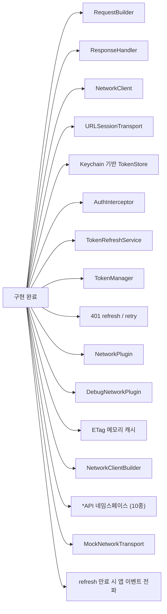
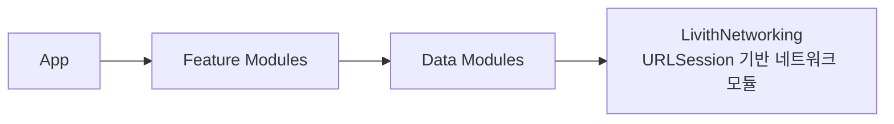
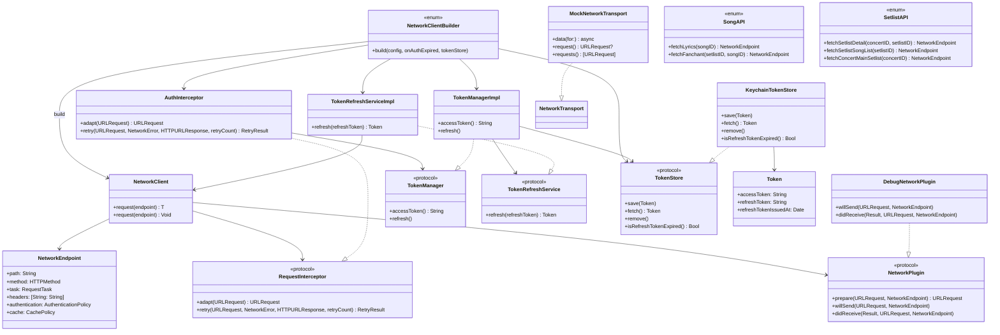
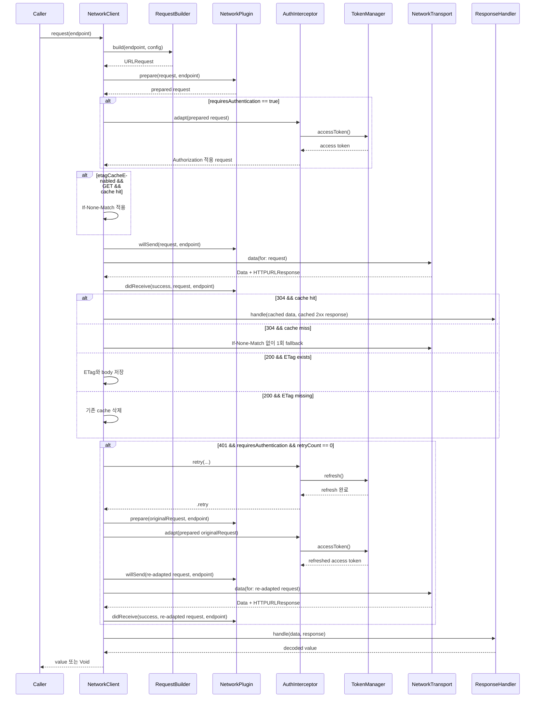
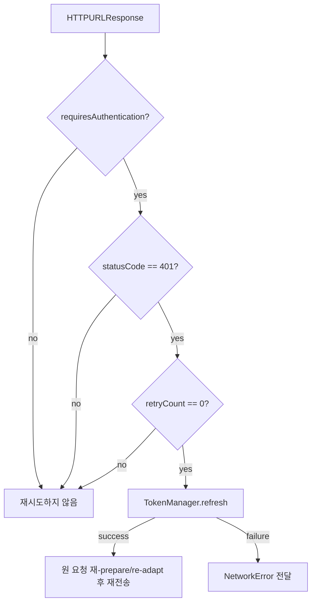
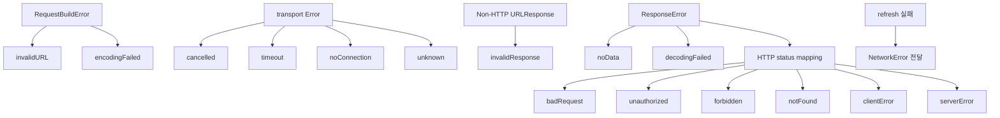
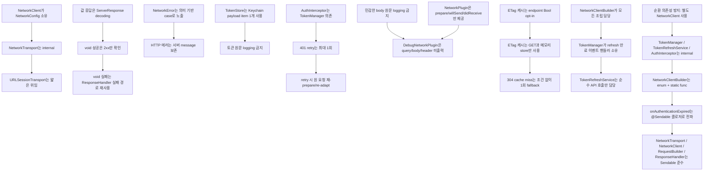

# LivithNetworking

`LivithNetworking`은 기존 `LivithNetwork`를 대체하는 URLSession 기반 네트워킹 모듈이다. 외부 라이브러리 없이 `RequestBuilder`, transport, `ResponseHandler`, Keychain 기반 토큰 저장소, 인증 헤더 삽입, refresh token 기반 재발급, 401 refresh/retry, plugin 기반 요청/응답 생명주기 확장, ETag 기반 메모리 캐시 흐름까지 연결한다.

기존의 `*Service` 계층(thin wrapper)은 제거하고, `*API` 네임스페이스의 `static func`로 엔드포인트를 정의한다. Repository는 `NetworkClient`를 직접 주입받아 `networkClient.request(*API.method(...))` 형태로 호출한다.

## 현재 범위



## 모듈 경계



## 타입 관계



## 요청 흐름



## 401 refresh/retry 정책



- retry 대상은 인증 endpoint의 401 응답만이다.
- retry 횟수는 최대 1회로 고정한다.
- 재시도 시 실패한 adapted request를 재사용하지 않고 원 요청에 plugin `prepare`와 interceptor `adapt`를 다시 적용한다.
- refresh 실패 시 원 요청을 재전송하지 않고 `NetworkError`를 전달한다.
- refresh 토큰까지 만료된 경우(401) `onAuthenticationExpired` 클로저를 통해 앱으로 이벤트를 전파한다.
- 비인증 endpoint는 `adapt`와 `retry` hook을 모두 호출하지 않는다.
- plugin hook은 인증 여부와 무관하게 호출한다.

## ETag 캐시 정책

- `etagCacheEnabled == true`인 GET 요청에만 적용한다.
- 캐시는 `NetworkClient` 인스턴스가 소유하는 메모리 저장소를 사용하며, `URLCache`나 디스크 저장소를 사용하지 않는다.
- 캐시 키는 실제 전송 URL 기준의 `HTTP method + absolute URL`이다.
- 200 응답에 `ETag` 헤더가 있으면 ETag와 response body를 저장한다.
- 200 응답에 `ETag` 헤더가 없으면 해당 key의 기존 캐시를 삭제한다.
- 같은 key의 캐시가 있으면 다음 요청에 `If-None-Match`를 추가한다.
- 304 응답이 오면 캐시된 body와 저장된 2xx status metadata를 사용해 기존 decoding 경로로 반환한다.
- 304 응답인데 캐시가 없으면 `If-None-Match` 없이 1회 fallback 요청한다.
- 네트워크 실패 시 기존 캐시를 반환하는 offline fallback은 제공하지 않는다.
- 로그아웃 또는 사용자 전환 시 `await client.removeAllETagCache()`를 호출해 현재 클라이언트의 캐시를 비울 수 있다.

## 에러 경계



## 에러 처리 예시

```swift
do {
    let value: SomeResponse = try await client.request(endpoint)
} catch .unauthorized(let message) {
    // refresh/retry 후에도 401이거나 refresh에 실패한 경우.
} catch .noConnection {
    // 네트워크 연결 안내
} catch .serverError(let statusCode, let message) {
    // 서버 장애 또는 점검 안내
} catch {
    // errorDescription은 기본 한글 설명을 제공한다.
}
```

## 파일 구조

```mermaid
flowchart TD
    Root[Projects/LivithNetworking]
    Sources[Sources]
    Tests[Tests]
    API[Sources/API]
    Foundation[Sources/Foundation]
    DTO[Sources/DTO]
    Testing[Sources/Testing]
    Service[Sources/Service]

    Root --> Sources
    Root --> Tests
    Sources --> API
    Sources --> Foundation
    Sources --> DTO
    Sources --> Testing
    Sources --> Service

    API --> SongAPI[SongAPI.swift]
    API --> SetlistAPI[SetlistAPI.swift]
    API --> ConcertAPI[ConcertAPI.swift]
    API --> CommentAPI[CommentAPI.swift]
    API --> HomeAPI[HomeAPI.swift]
    API --> NotificationAPI[NotificationAPI.swift]
    API --> OnboardingAPI[OnboardingAPI.swift]
    API --> PreferenceAPI[PreferenceAPI.swift]
    API --> SearchAPI[SearchAPI.swift]
    API --> UserAPI[UserAPI.swift]

    Foundation --> Client[Client]
    Foundation --> Request[Request]
    Foundation --> Response[Response]
    Foundation --> Interceptor[Interceptor]
    Foundation --> Plugin[Plugin]
    Foundation --> Token[Token]
    Foundation --> Helper[Helper]

    Client --> NetworkClient[NetworkClient.swift]
    Client --> NetworkClientBuilder[NetworkClientBuilder.swift]
    Client --> NetworkError[NetworkError.swift]
    Client --> NetworkTransport[NetworkTransport.swift]
    Client --> NetworkConfig[NetworkConfig.swift]
    Client --> RequestAttempt[RequestAttempt.swift]

    Testing --> MockNetworkTransport[MockNetworkTransport.swift]
    Service --> TokenRefresh[TokenRefreshService.swift]
```



## 사용 형태

### NetworkClientBuilder로 생성 (권장)

팩토리가 `NetworkClient` + `TokenStore`를 한 번에 생성한다. App에서 `NetworkClientBuilder.build()`로 조립 후 DI 컨테이너에 등록한다.

```swift
// App 진입점
let config = NetworkConfig(baseURL: baseURL)
let onAuthenticationExpired: @Sendable () -> Void = {
    Task { @MainActor in
        NotificationCenter.default.post(
            name: Notification.Name("reloginRequired"),
            object: nil
        )
    }
}
let (client, tokenStore) = NetworkClientBuilder.build(
    config: config,
    onAuthenticationExpired: onAuthenticationExpired
)
container.register(client, for: NetworkClient.self)
container.register(tokenStore, for: TokenStore.self)
```

### DataAssembler에서 주입

```swift
// 각 DataAssembler에서 DI로 NetworkClient resolve
func registerSongRepository(to container: any DependencyContainer) {
    let client = container.resolve(NetworkClient.self)
    let songRepo = SongRepositoryImpl(networkClient: client)
    container.register(songRepo, for: SongRepository.self)
}
```

### Repository에서 사용

```swift
struct SongRepositoryImpl: SongRepository {
    private let networkClient: NetworkClient
    private let mapper: SongMapper = .init()
    private let errorMapper: SongErrorMapper = .init()

    init(networkClient: NetworkClient) {
        self.networkClient = networkClient
    }

    func fetchSongLyrics(songID: Int) async throws(SongError) -> SongLyrics {
        do {
            let response: DTO.Response.FetchSongLyrics = try await networkClient.request(
                SongAPI.fetchSongLyrics(songID: songID)
            )
            return mapper.toDomain(from: response)
        } catch {
            throw errorMapper.mapToSongError(error)
        }
    }
}
```

### 비인증 요청 (interceptor 없음)

```swift
let client = NetworkClient(config: NetworkConfig(baseURL: baseURL))
let value: SomeResponse = try await client.request(endpoint)
try await client.request(voidEndpoint)
```

### 테스트 (MockNetworkTransport)

```swift
let transport = MockNetworkTransport(output: .success(data, response))
let client = NetworkClient(config: config, transport: transport)
let repo = SongRepositoryImpl(networkClient: client)
```

### 디버그 플러그인

```swift
#if DEBUG
let client = NetworkClient(
    config: config,
    interceptor: authInterceptor,
    plugins: [DebugNetworkPlugin()]
)
#else
let client = NetworkClient(
    config: config,
    interceptor: authInterceptor
)
#endif
```

`DebugNetworkPlugin`은 기본적으로 구분선과 모듈명을 포함한 로그 블록에 method, userinfo/query/fragment를 제거한 URL의 scheme/host/path, status code, 전송 실패 요약만 출력한다. query string, request/response body, request/response header 값은 출력하지 않는다.

## 플러그인과 인터셉터 책임

| 타입 | 책임 | 요청 수정 | 재시도 정책 |
|------|------|-----------|-------------|
| `NetworkPlugin` | 요청/응답 생명주기 확장, 로깅, metrics, activity tracking | `prepare`에서 가능 | 담당하지 않음 |
| `RequestInterceptor` | 인증 헤더 삽입, 401 refresh/retry | `adapt`에서 가능 | `retry`에서 담당 |

## 확정된 결정


```

## LocalizedError 및 보안 정책

- `NetworkError`는 `LocalizedError`를 채택한다.
- `TokenError`는 `LocalizedError`를 채택한다.
- HTTP 에러의 `errorDescription`은 서버 `message`가 있으면 포함한다.
- response body 원문은 logging하거나 설명 문구에 포함하지 않는다.
- request body 원문은 logging하지 않는다.
- 토큰 원문, refresh token, Authorization 헤더 전체 값, Cookie, Set-Cookie, API key, Keychain payload 원문은 logging하거나 설명 문구에 포함하지 않는다.
- `DebugNetworkPlugin`은 URL userinfo, query string, fragment, request/response header 값을 기본 출력하지 않는다.
- `ETag`와 `If-None-Match` 원문 값은 불필요하게 logging하지 않는다.
- 토큰과 비밀값은 `UserDefaults` 계열 저장소에 저장하지 않는다.

## 검증

```bash
tuist generate
xcodebuild test -workspace Livith-iOS.xcworkspace -scheme LivithNetworking -destination 'platform=iOS Simulator,name=iPhone 17'
git diff --check
```

