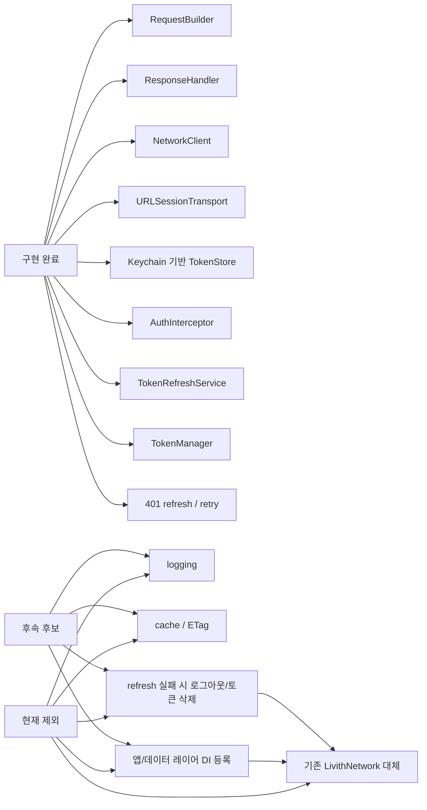
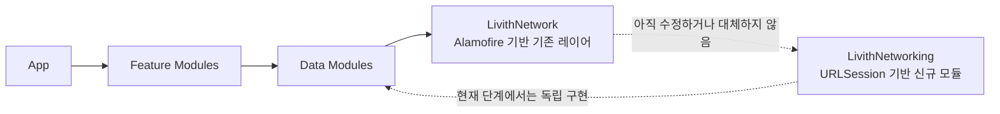
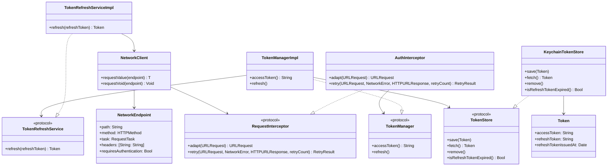
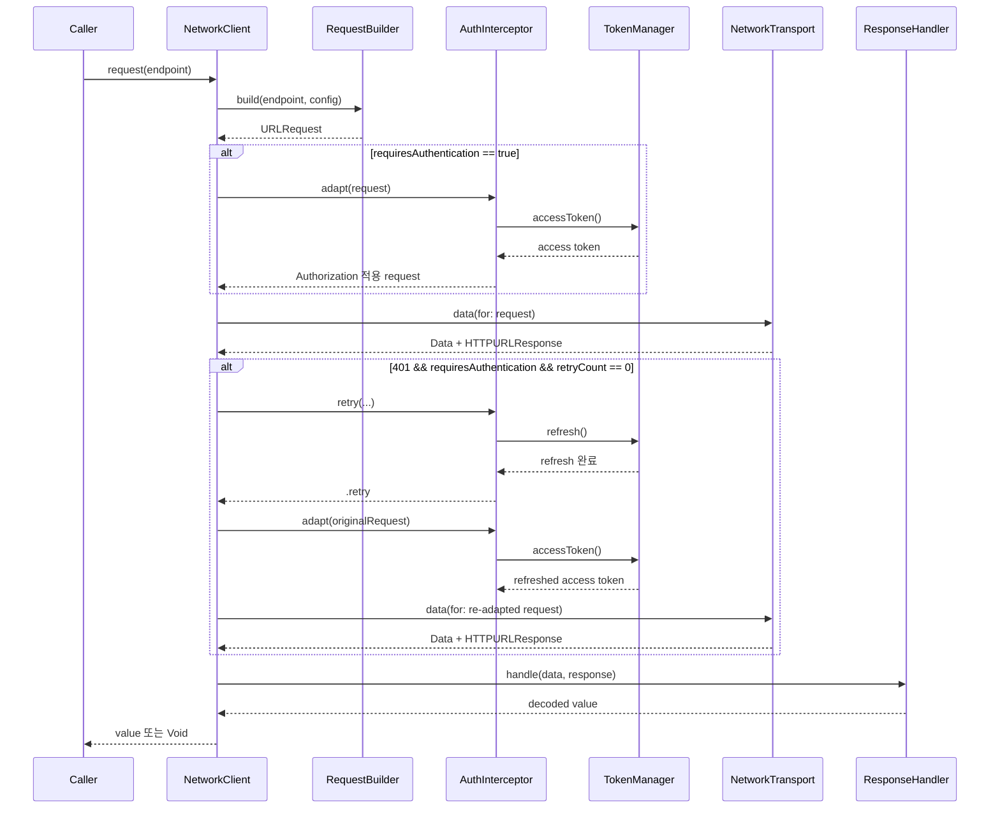
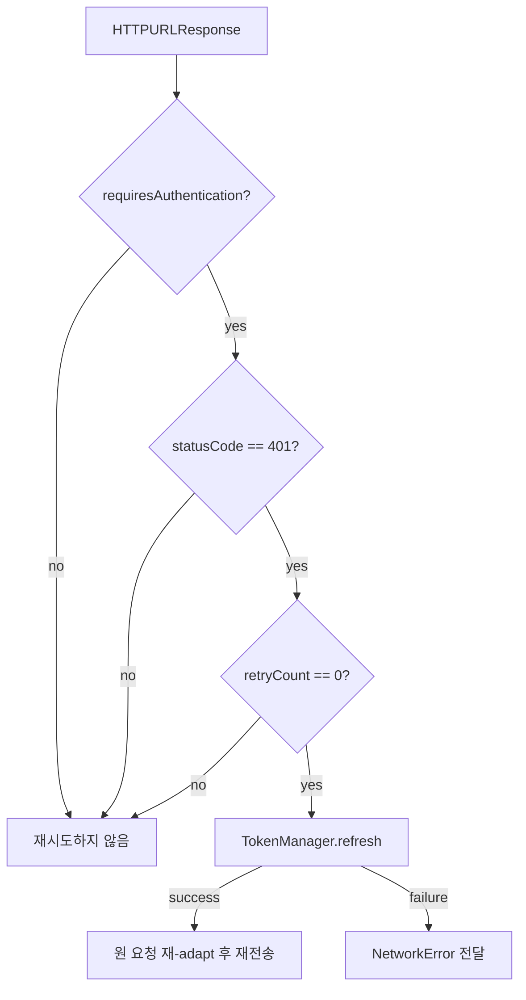
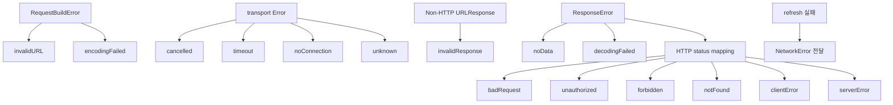
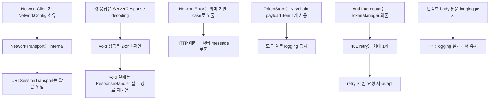

# LivithNetworking

`LivithNetworking`은 기존 `LivithNetwork`를 바로 대체하지 않는 신규 네트워킹 모듈이다. 현재 단계에서는 외부 라이브러리 없이 `RequestBuilder`, transport, `ResponseHandler`, Keychain 기반 토큰 저장소, 인증 헤더 삽입, refresh token 기반 재발급, 401 refresh/retry 흐름까지 연결한다.

## 현재 범위



## 모듈 경계



## 타입 관계



## 요청 흐름



## 401 refresh/retry 정책



- retry 대상은 인증 endpoint의 401 응답만이다.
- retry 횟수는 최대 1회로 고정한다.
- 재시도 시 실패한 adapted request를 재사용하지 않고 원 요청을 다시 `adapt`한다.
- refresh 실패 시 원 요청을 재전송하지 않고 `NetworkError`를 전달한다.
- 비인증 endpoint는 `adapt`와 `retry` hook을 모두 호출하지 않는다.

## 에러 경계



## 에러 처리 예시

```swift
do {
    let value: SomeResponse = try await client.request(endpoint)
} catch .unauthorized(let message) {
    // refresh/retry 후에도 401이거나 refresh에 실패한 경우.
} catch .noConnection {
    // 네트워크 연결 안내
} catch .serverError(let statusCode, let message) {
    // 서버 장애 또는 점검 안내
} catch {
    // errorDescription은 기본 한글 설명을 제공한다.
}
```

## 파일 구조

```mermaid
flowchart TD
    Root[Projects/LivithNetworking]
    Sources[Sources]
    Tests[Tests]
    Request[Sources/Request]
    Response[Sources/Response]
    Client[Sources/Client]
    Interceptor[Sources/Interceptor]
    Token[Sources/Token]
    Service[Sources/Service]
    DTO[Sources/DTO]
    ClientTests[Tests/Client]
    InterceptorTests[Tests/Interceptor]
    TokenTests[Tests/Token]

    Root --> Sources
    Root --> Tests
    Sources --> Request
    Sources --> Response
    Sources --> Client
    Sources --> Interceptor
    Sources --> Token
    Sources --> Service
    Sources --> DTO
    Tests --> ClientTests
    Tests --> InterceptorTests
    Tests --> TokenTests

    Client --> NetworkClient[NetworkClient.swift]
    Client --> NetworkError[NetworkError.swift]
    Client --> Transport[NetworkTransport.swift]

    Interceptor --> RequestInterceptor[RequestInterceptor.swift]
    Interceptor --> AuthInterceptor[AuthInterceptor.swift]

    Token --> TokenModel[Token.swift]
    Token --> TokenError[TokenError.swift]
    Token --> Expiration[TokenExpirationPolicy.swift]
    Token --> TokenStoreFile[TokenStore.swift]
    Token --> KeychainStorage[KeychainStorage.swift]
    Token --> TokenManagerFile[TokenManager.swift]

    Service --> TokenRefresh[TokenRefreshService.swift]
    DTO --> DTOFile[DTO.swift]
    DTO --> AuthToken[Auth/AuthToken.swift]

    ClientTests --> NetworkClientTests[NetworkClientTests.swift]
    InterceptorTests --> AuthInterceptorTests[AuthInterceptorTests.swift]
    TokenTests --> TokenModelTests[TokenTests.swift]
    TokenTests --> ExpirationTests[TokenExpirationPolicyTests.swift]
    TokenTests --> KeychainStoreTests[KeychainTokenStoreTests.swift]
    TokenTests --> TokenRefreshTests[TokenRefreshServiceTests.swift]
    TokenTests --> TokenManagerTests[TokenManagerTests.swift]
```



## 사용 형태

### 비인증 또는 interceptor 없는 요청

```swift
let client = NetworkClient(
    config: NetworkConfig(baseURL: baseURL)
)

let value: SomeResponse = try await client.request(endpoint)
try await client.request(voidEndpoint)
```

### 인증 요청

```swift
let config = NetworkConfig(baseURL: baseURL)
let authInterceptor = AuthInterceptor(config: config)
let client = NetworkClient(
    config: config,
    interceptor: authInterceptor
)

let value: SomeResponse = try await client.request(authenticatedEndpoint)
```

### 직접 조립

```swift
let tokenStore: any TokenStore = KeychainTokenStore()
let tokenRefreshService: any TokenRefreshService = TokenRefreshServiceImpl(config: config)
let tokenManager: any TokenManager = TokenManagerImpl(
    tokenStore: tokenStore,
    tokenRefreshService: tokenRefreshService
)
let authInterceptor = AuthInterceptor(tokenManager: tokenManager)
let client = NetworkClient(config: config, interceptor: authInterceptor)
```

## 확정된 결정



## LocalizedError 및 보안 정책

- `NetworkError`는 `LocalizedError`를 채택한다.
- `TokenError`는 `LocalizedError`를 채택한다.
- HTTP 에러의 `errorDescription`은 서버 `message`가 있으면 포함한다.
- response body 원문은 logging하거나 설명 문구에 포함하지 않는다.
- 토큰 원문, refresh token, Authorization 헤더 전체 값, Keychain payload 원문은 logging하거나 설명 문구에 포함하지 않는다.
- 토큰과 비밀값은 `UserDefaults` 계열 저장소에 저장하지 않는다.

## 검증

```bash
tuist generate
xcodebuild test -workspace Livith-iOS.xcworkspace -scheme LivithNetworking -destination 'platform=iOS Simulator,name=iPhone 17'
git diff --check
```

## 관련 문서

- `docs/designs/LIVD-298-livith-networking-boundary.md`
- `docs/designs/LIVD-298-livith-networking-basic-request.md`
- `docs/designs/LIVD-298-livith-networking-response.md`
- `docs/designs/LIVD-298-livith-networking-client.md`
- `docs/designs/LIVD-395-livith-networking-token-store.md`
- `docs/archives/LIVD-395-livith-networking-token-management.md`
- `docs/archives/LIVD-395-livith-networking-token-management-troubleshooting.md`
