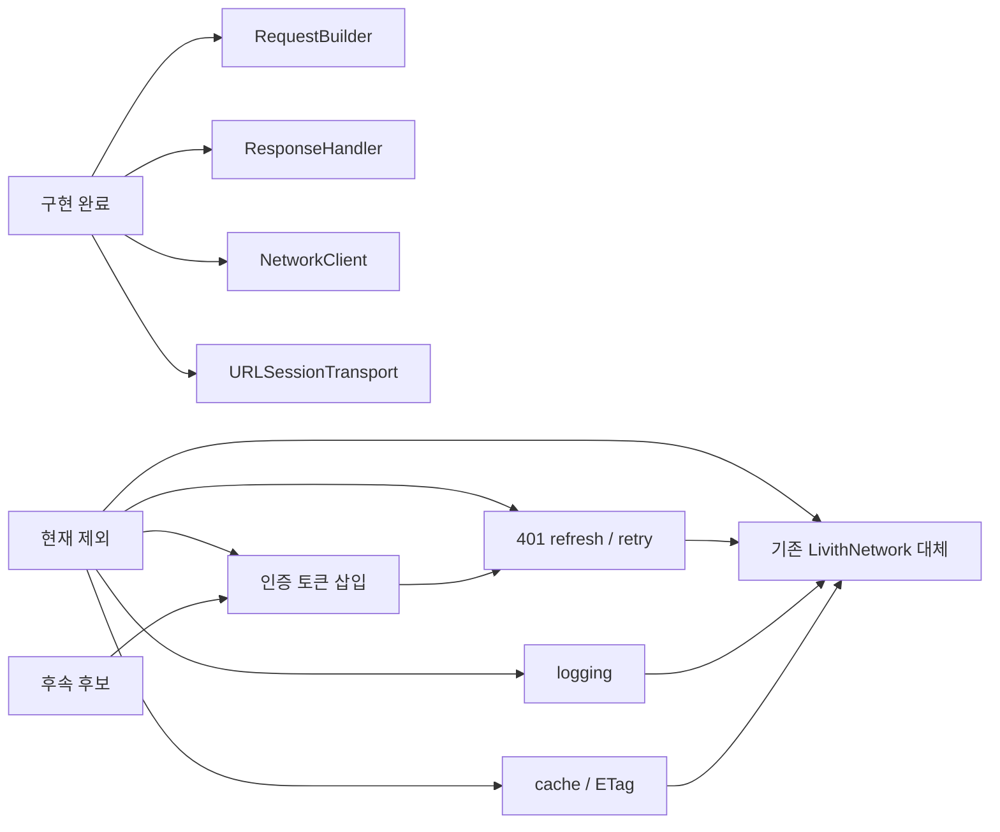
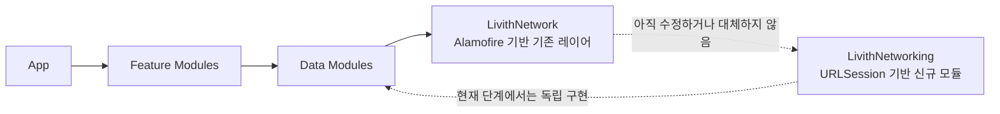
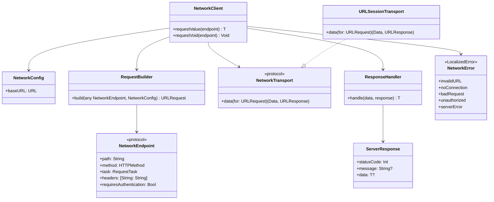
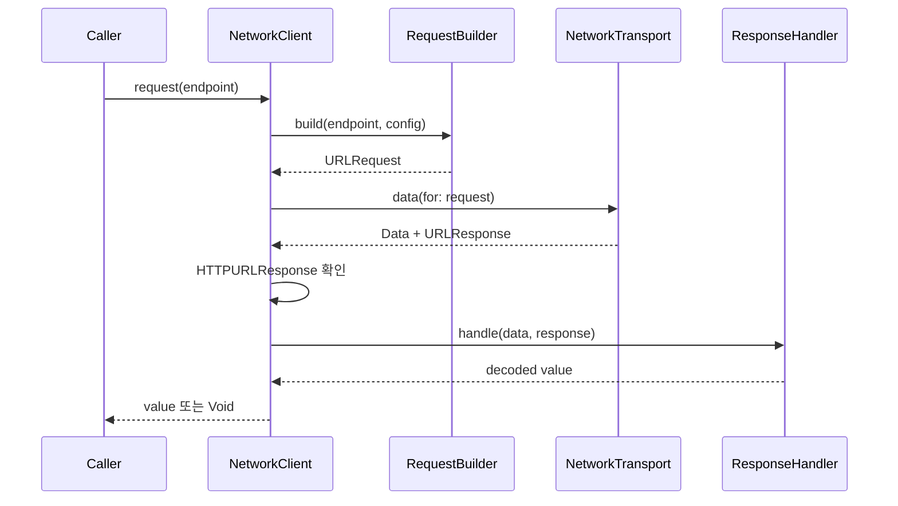
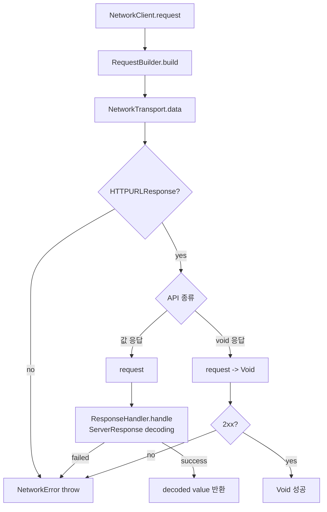
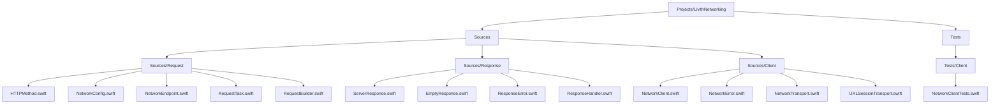
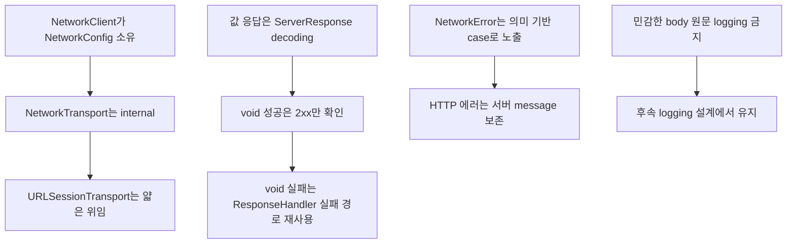

# LivithNetworking

`LivithNetworking`은 기존 `LivithNetwork`를 바로 대체하지 않는 신규 네트워킹 모듈이다. 현재 단계의 목표는 외부 라이브러리 없이 `RequestBuilder`, transport, `ResponseHandler`를 연결하는 최소 클라이언트 경계를 고정하는 것이다.

## 현재 범위



## 모듈 경계



## 타입 관계



## 요청 흐름



## 응답 분기



## 에러 경계

```mermaid
flowchart TD
    Build[RequestBuildError]
    Transport[transport Error]
    NonHTTP[Non-HTTP URLResponse]
    Response[ResponseError]

    InvalidURL[invalidURL]
    Encoding[encodingFailed(Error)]
    Cancelled[cancelled]
    Timeout[timeout(Error)]
    Connection[noConnection(Error)]
    Unknown[unknown(Error)]
    InvalidResponse[invalidResponse]
    NoData[noData]
    Decoding[decodingFailed(Error)]
    HTTP[HTTP status mapping]

    Build --> InvalidURL
    Build --> Encoding
    Transport --> Cancelled
    Transport --> Timeout
    Transport --> Connection
    Transport --> Unknown
    NonHTTP --> InvalidResponse
    Response --> NoData
    Response --> Decoding
    Response --> HTTP

    HTTP --> BadRequest[badRequest(message)]
    HTTP --> Unauthorized[unauthorized(message)]
    HTTP --> Forbidden[forbidden(message)]
    HTTP --> NotFound[notFound(message)]
    HTTP --> ClientError[clientError(statusCode, message)]
    HTTP --> ServerError[serverError(statusCode, message)]
```

## 에러 처리 예시

```swift
do {
    let value: SomeResponse = try await client.request(endpoint)
} catch .unauthorized(let message) {
    // 401 refresh/retry는 후속 설계에서 다룬다.
} catch .noConnection {
    // 네트워크 연결 안내
} catch .serverError(let statusCode, let message) {
    // 서버 장애 또는 점검 안내
} catch {
    // errorDescription은 기본 한글 설명을 제공한다.
}
```

## 파일 구조



## 사용 형태

```swift
let client = NetworkClient(
    config: NetworkConfig(baseURL: baseURL)
)

let value: SomeResponse = try await client.request(endpoint)
try await client.request(voidEndpoint)
```

## 확정된 결정



## LocalizedError 정책

- `NetworkError`는 `LocalizedError`를 채택한다.
- HTTP 에러의 `errorDescription`은 서버 `message`가 있으면 포함한다.
- response body 원문은 logging하거나 설명 문구에 포함하지 않는다.

## 검증

```bash
tuist generate
xcodebuild test -scheme LivithNetworking -destination 'platform=iOS Simulator,name=iPhone 17,OS=26.4.1'
git diff --check
```

## 관련 문서

- `docs/designs/LIVD-298-livith-networking-boundary.md`
- `docs/designs/LIVD-298-livith-networking-basic-request.md`
- `docs/designs/LIVD-298-livith-networking-response.md`
- `docs/designs/LIVD-298-livith-networking-client.md`
- `docs/plans/LIVD-298-livith-networking-client.md`
- `docs/plans/LIVD-298-livith-networking-error.md`
- `docs/troubleshooting/LIVD-298-livith-networking.md`
